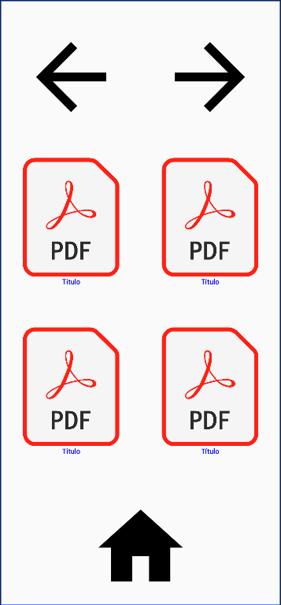

# BLINK
Aplicação android feita em kotlin ainda em estágio de produção, cujo objetivo é usar rastreamento de olhar para permitir que pessoas com ELA possam ler livros pelo tablet. 

## Interfaces

## Estrutura do projeto
O diretório app/src/main contém o código fonte, sendo que o caminho java/com/rafael/eftr contém efetivamente os códigos, enquanto a pasta res os recursos da aplicação, como imagens e ícones.
 
 
As pastas androidTest e test dentro de src são para testes em um dispositivo android e testes locais, respectivamente.

## Execução
Para executar, clone o repositório e baixe o Android-studio. Depois, com o Android-studio abra o projeto. Você pode testar a aplicacao em um emulador ou em um dispositivo físico.
