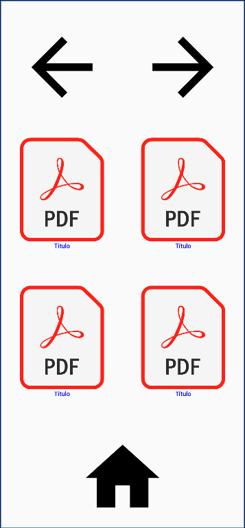

# PISK
Aplicação android feita em kotlin ainda em estágio de produção, cujo objetivo é usar rastreamento de olhar para permitir que pessoas com ELA possam ler livros pelo tablet. 
______________
## Interfaces

______________
## Execução

Para executar, clone o repositório e baixe o Android-studio. Depois, com o Android-studio abra o
projeto. Você pode testar a aplicacao em um emulador ou em um dispositivo físico.
